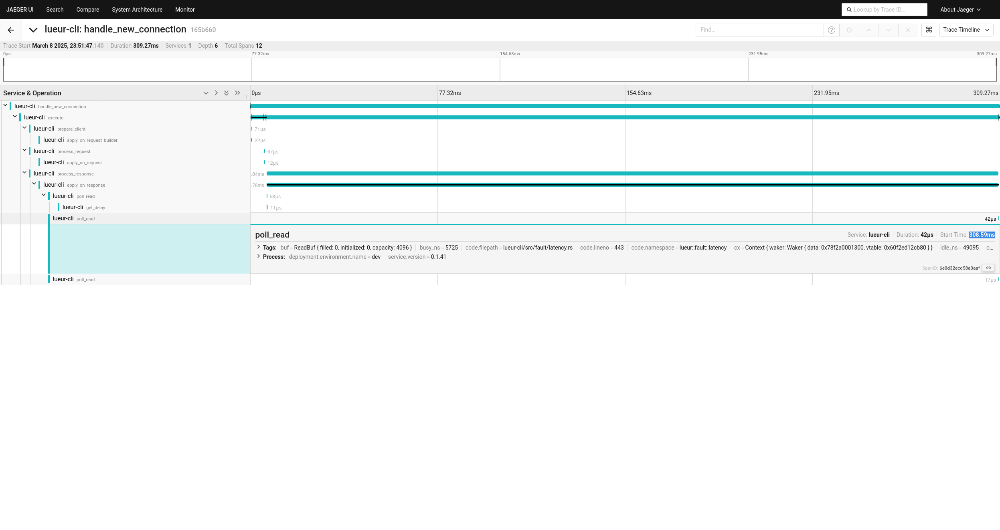

# Enable <span class="f">fault</span> Observability

This guide will walk you sending traces to an Open Telemetry aware stack.

??? abstract "Prerequisites"

    -   [X] Install <span class="f">fault</span>

        If you haven’t installed <span class="f">fault</span> yet, follow the
        [installation instructions](../install.md).

## Send Open Telemetry Traces to Jaeger

-   [X] Start a local Jaeger instance

    Follow the
    [Jaeger instructions](https://www.jaegertracing.io/docs/2.4/getting-started/)
    to deploy a local instance

-   [X] Start demo application provided by <span class="f">fault</span>

    ```bash
    fault demo run
    ```

-   [X] Start the proxy with a basic latency fault

    ```bash
    fault --with-otel \  # (1)!
        run \
        --with-latency \ 
        --latency-distribution normal \
        --latency-mean 300 \
        --latency-stddev 40
    ```

    1.  Configure fault to generate and send Open Telemetry traces
   

-   [X] Send a request to the demo application routed via the proxy

    ```bash
    curl -x http://localhost:3180 http://localhost:7070
    ```

-   [X] View <span class="f">fault</span> traces

    Open your browser and
    [view your fault traces](http://localhost:16686/search?operation=apply_on_response&service=fault-cli).

    In the following snippet, you can quickly notice the `~308ms` delay on the
    poll-read. { align=right }