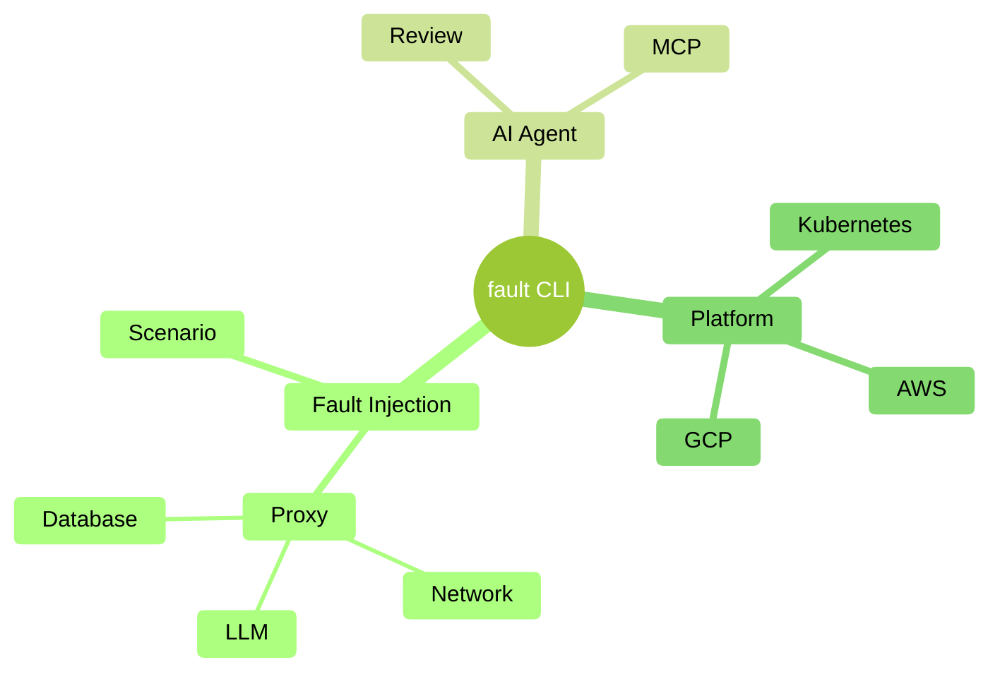

# tl;dr

## Overview

fault comes with the following main capabilities in one CLI.

* Fault Injection: operation oriented features
* AI Agent: LLM-based features
* Easy platform injection

## Getting started with fault injection

The core of fault is its fault injection engine. It
allows you to:

-   [X] Inject faults into your services

    Run `fault run` to start injecting network failures

-   [X] Automate these failures into YAML files that can be run from your CI

    Run `fault scenario generate` and `fault scenario run` to create
    YAML-based scenarios that can be stored alongside your code and executed
    from your CI.

## Getting started with fault injection for LLM

The core of fault is its fault injection engine. It
offers a nice way to inject LLM-specific faults into your your LLM calls:

-   [X] Inject faults into your services making calls to LLM providers

    Run `fault run llm` to start injecting LLM faults

## Getting started with platform injection

fault makes it easy to inject itself into
your platform so you can easily explore faults there as well.

-   [X] Inject faults into your favourite platform

    Run `fault inject` to start injecting faults

## Getting started with the AI Agent

If you are keen to get started with the AI-agent, the general steps are as
follows:

-   [X] Pick up your favorite LLM

    fault supports OpenAI, Gemini, OpenRouter and ollama.
    If you use any of the cloud-based LLMs, you will need to generate an API
    key. If you want privacy, go with ollama.

-   [X] Configure your AI-Code editor

    [Setup the editor](../how-to/agent/llm-configuration.md) of your choice so
    it knows how to find fault as a MCP server. Most of the time it's by adding
    a `mcpServers` object somewhere in their settings file.

## Next Steps

* **Start exploring our [tutorials](getting-started.md)** to gently get into using fault.
* **Explore our [How-To guides](../how-to/proxy/faults/configure-latency.md)** to explore fault's features.
